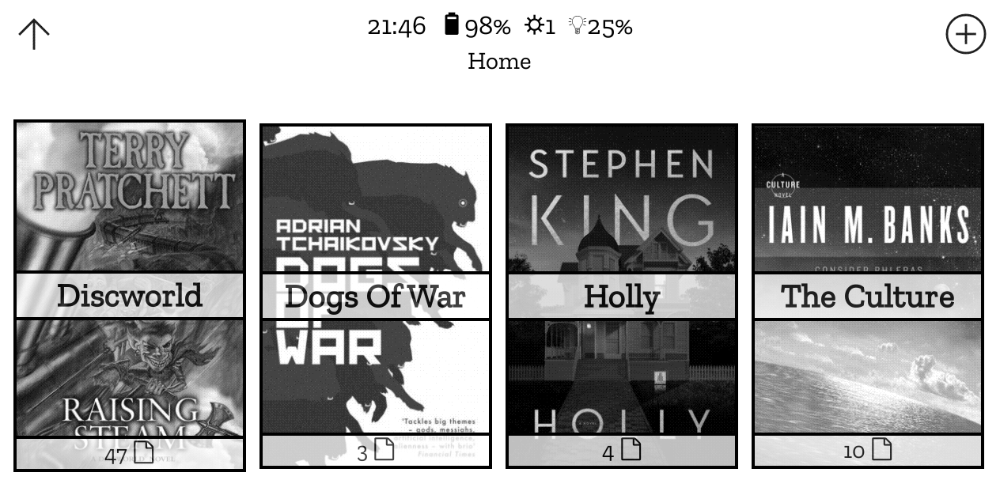
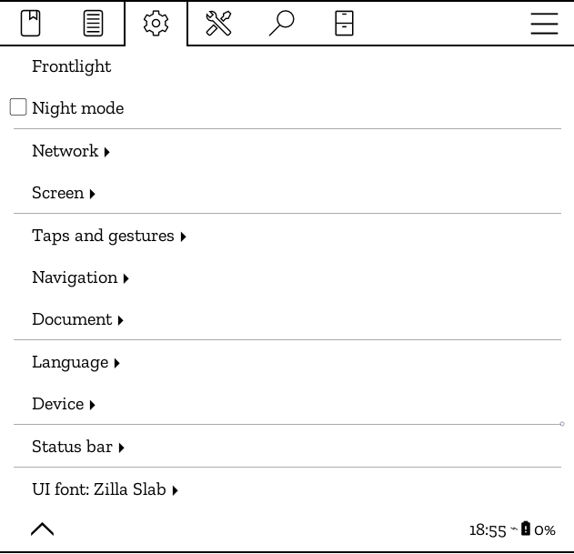
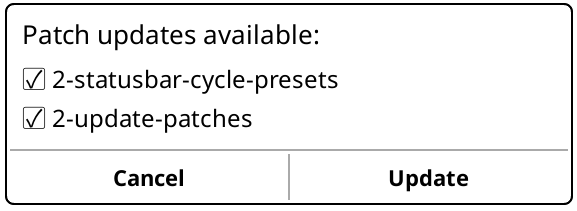
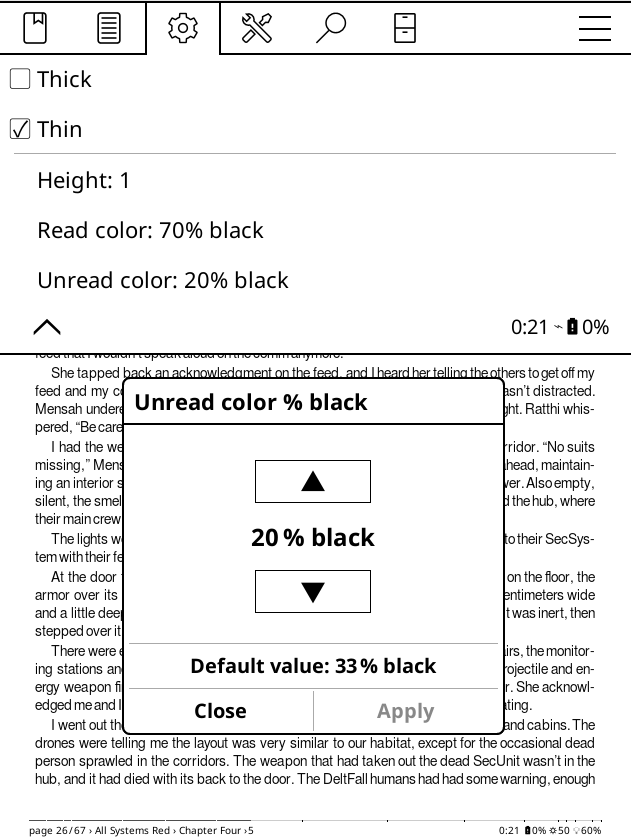
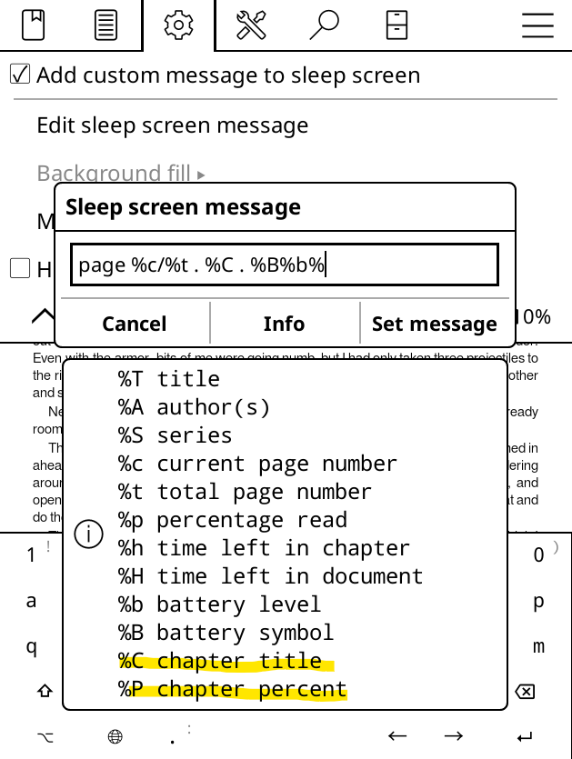
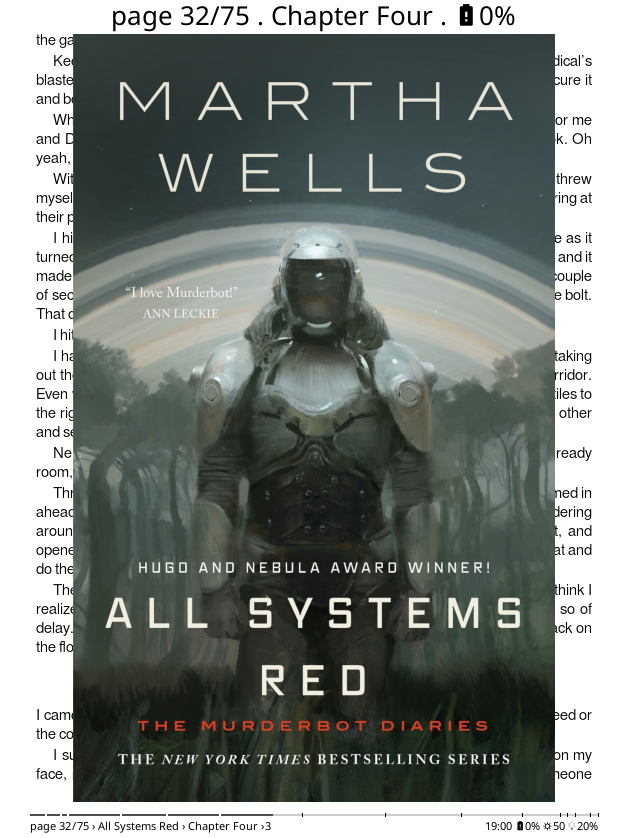
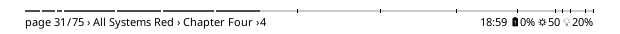

**All those patches work well together on** 

### [🞂 How to install a user patch ?](https://koreader.rocks/user_guide/#L2-userpatches)

Please [check the guide here](https://koreader.rocks/user_guide/#L2-userpatches).

### [🞂 guard ](guard.lua)

This tool is used by patches that require a minimum KOReader version to work, and it prevents them from crashing if the requirement isn't met.

### [🞂 2-browser-hide-underline](2-browser-hide-underline.lua)

This patch removes the underline beneath the last visited book or folder.

You'll find its options under  **🞂 Settings 🞂 Mosaic and detailed list settings 🞂 Hide last visited underline**

### [🞂 2-browser-folder-cover](2-browser-folder-cover.lua)

This patch adds images to the mosaic folder entries: it uses the first cover according to the current sorting chosen by the user.

If you want to use your own folder cover, please add an image file in the folder named `.cover.jpg`, `.cover.jpeg`, `.cover.png`, `.cover.webp`, or `.cover.gif`.

You'll find its options under  **🞂 Settings 🞂 Mosaic and detailed list settings 🞂 Folder name centered** and **Crop folder custom image** and **Show folder name**

### [🞂 2-browser-up-folder](2-browser-up-folder.lua)

The Mosaic or list entry to move up a folder has been moved into the title bar: when in a subfolder, the  icon is replaced with an  icon.

Please find the option under  **🞂 Hide up folders**

You can also hide empty folders. Please find the option under  **🞂 Hide empty folders**.

### [🞂 2-ui-font](2--ui-font.lua)

This patch allows you to change the UI font.

You can find this option under  **🞂 UI font**

### [🞂 2-menu-size](2-menu-size.lua)

This patch adapts the menu size to the actual DPI.

### [🞂 2-update-patches](2-update-patches.lua)
This patch _requires_ at least KOReader v2025.04.107.

This patch lets you update all the patches here.

You'll find the update option in  **🞂 More tools 🞂 Update kadaan/KOReader.patches**

Note that the patches that are not checked or not installed won't be updated.

### [🞂 2-statusbar-thin-chapter](2-statusbar-thin-chapter.lua)
This patch add chapter markers in the thin status bar.

It has the exact same height as the regular status bar, but each unread chapter marker is taller to ensure visibility.

Chapter markers that have already been read appear as white spaces, just like the progress bar in the alternate status bar.

It only shows TOC entries at level 1 to avoid cluttering the progress bar.

It's configurable in the menu, just like the thick progress bar in  **🞂 Status bar 🞂 Progress bar**

### [🞂 2-statusbar-cycle-presets](2-statusbar-cycle-presets.lua)
This patch _requires_ at least KOReader v2025.04.52.

It enables cycling through your status bar presets by tapping the status bar.

Create your status bar presets under in  **🞂 Status bar 🞂 Status bar presets**

There's a catch: if you have presets with different fonts, progress bar styles, or anything else that triggers a full screen refresh, cycling through them might be a hassle (and a real battery drain too). Here's [why](https://github.com/koreader/koreader/pull/13718#issuecomment-2851940756).

### [🞂 2-change-status-bar-color](2-change-status-bar-color.lua) 
This patch enables you to change your status bar's `read` and `unread` colors.

You'll find it in  **🞂 Status bar 🞂 Progress bar 🞂 Thickness, height & colors**

### [🞂 2-reference-page-count](2-reference-page-count.lua)
This patch fixes the reference page count, so the status bar shows the actual number of pages when using the reference page option.

It also provides a fallback when there's no source for reference pages.

### [🞂 2-screensaver-chapter](2-screensaver-chapter.lua)
This patch _requires_ at least KOReader v2025.04.12 to display the screensaver’s info message.

This patch adds two new chapter options in the screensaver info message:
- %C chapter title
- %P chapter percent

Go to  **🞂 Screen 🞂 Sleep screen 🞂 Sleep screen message 🞂 Edit Sleep screen message**

### [🞂 2-screensaver-cover](2-screensaver-cover.lua)
This patch adds 4 new options at the end of  **🞂 Screen 🞂 Sleep screen**:
- Prevent the sleep screen message from overlapping the image.
- Center the image.
- Close all the widgets before showing the screensaver.
- Option to refresh before showing the screensaver.
- Keep the message color even in night mode.
- Option to invert the message color when No fill is set.

By default, it does not change the sleep screen behavior.

### [🞂 2-statusbar-better-compact](2-statusbar-better-compact.lua) 
This patch enhances compact mode in the status bar:
- Uses improved frontlight icons and adds the battery percentage
- Provides a better separator for title, chapter, and author when compact mode has no separator

### [🞂 2-disable-top-menu-zones](2-disable-top-menu-zones.lua)
This patch removes the top menu swipe and tap zones, so you'll be sure to open it in the last tab you were on.

### [🞂 2-menutext-overrides](2-menutext-overrides.lua)
This patch modifies filenames in the file browser, replacing underscores with spaces and moving trailing articles (", The", ", An", ", A") to the front.

Example: "Frog_Bucket,_The" displays as "The Frog Bucket"

### [🞂 2-project-title-font-override](2-project-title-font-override.lua)
This patch is primarily for use with the Project: Title plugin. It sets the UI fonts to the sans serif font used in the plugin (SourceSans3).

### [🞂 2-project-title-reader-footer-font-override](2-project-title-reader-footer-font-override.lua)
This patch is primarily for use with the Project: Title plugin. It sets the status bar (footer) font to the serif font used in the plugin (SourceSerif4).

### [🞂 2-project-title-disable-fullyread-progressbars](2-project-title-disable-fullyread-progressbars.lua)
This patch is primarily for use with the Project: Title plugin. It hides progress bars in Cover Grid when a book has been finished, with an optional setting to display a trophy icon in the lower right corner.

### [🞂 2-project-title-disable-unread-progressbars](2-project-title-disable-unread-progressbars.lua)
This patch is primarily for use with the Project: Title plugin. It hides progress bars in Cover Grid when a book has not been opened yet.

### [🞂 2-reader-header-cornered](2-reader-header-cornered.lua)
This patch adds a "header" into the reader display (similar to the footer at the bottom), with two items displayed in the upper left and upper right corners. Only works for reflowable documents like EPUB.

### [🞂 2-project-title-trailing-article](2-project-title-trailing-article.lua)
This patch is primarily for use with the Project: Title plugin. It moves trailing articles (", The", ", An", ", A") to the front of folder names displayed in the bottom-left footer.

Example: "Wheel of Time, The" displays as "The Wheel of Time"
